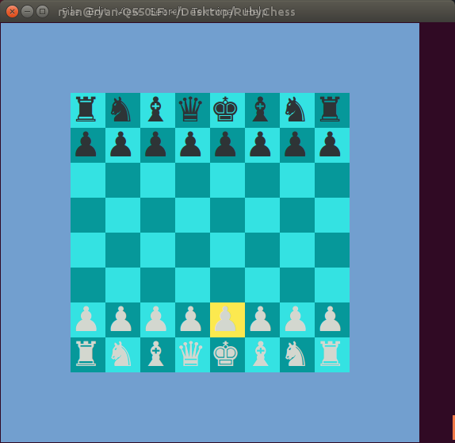
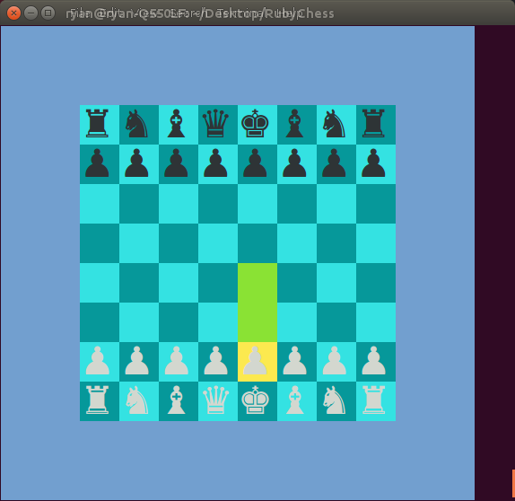
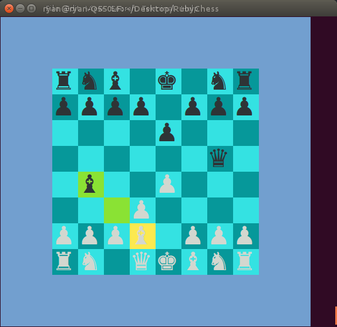
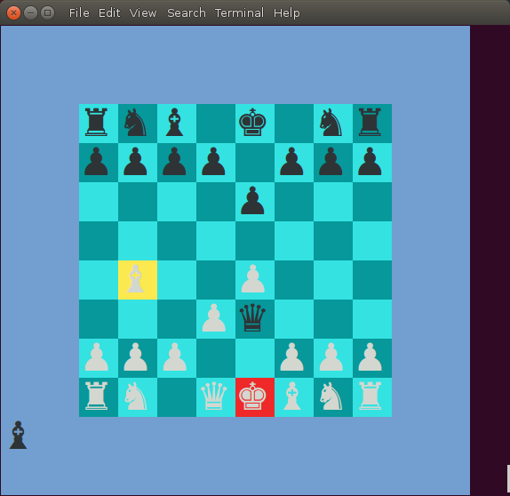

# RubyChess

###
* Class inheritance
* Exceptions, error handling
* Decomposition into objects
* Inheritance, Polymorphism and DRY
* Information hiding/encapsulation
* move suggestions
* Simple AI

# How to run RubyChess
These files require Ruby to run. The best tutorial I've found is this: [Ruby Installation Tutorial](http://installrails.com/steps)

Once Ruby is installed, clone this repo, bundle install, go into terminal, and either run the game interface

$ ruby chess.rb

## Game Setup
<ol>
  <li>Enter player names when prompted (or press enter to select a basic AI opponent)</li>
  <li>Control the yellow highlight square with the arrow keys. 
     
    
  </li>
  <li>Select your desired piece to move with "enter" to see available moves.
  Then select one of the available moves and press "enter" again to commit the move.
     
    
  </li>
  <li>Only legal moves will be displayed.
     
    
  </li>
  <li>King will illuminate red if in check, and only available moves are ones that
    get the king out of check
     
    
  </li>
</ol>
